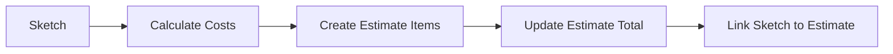
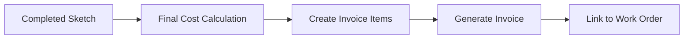

# Interior Sketch System - Backend Architecture

## Overview

This document describes the comprehensive backend architecture for the Interior Sketch System in the MJ React App FastAPI backend. The system follows the existing Domain-Driven Design patterns and integrates seamlessly with the current estimate/invoice workflow.

## Domain Structure

The sketch domain follows the established 5-file pattern:

```
backend/app/domains/sketch/
├── __init__.py           # Domain package initialization
├── models.py            # SQLAlchemy database models
├── schemas.py           # Pydantic request/response schemas
├── repository.py        # Data access layer with database abstraction
├── service.py          # Business logic layer
└── api.py              # FastAPI REST API endpoints
```

## Database Models

### Core Entities

#### 1. Sketch (Main Entity)
- **Purpose**: Primary sketch container with metadata and canvas properties
- **Key Fields**:
  - Basic: name, description, project_type, status
  - Canvas: canvas_width/height, scale_factor, scale_unit
  - Integration: company_id, estimate_id, invoice_id, work_order_id
  - Calculated: total_area, total_perimeter, total_wall_area
  - Versioning: version, is_template, template_category

#### 2. Room
- **Purpose**: Distinct spaces within a sketch
- **Key Fields**:
  - Physical: area, perimeter, ceiling_height, floor_level
  - Visual: fill_color, stroke_color, opacity
  - Geometry: stored as flexible JSON structure
  - Cost: cost_category, estimated_cost

#### 3. Wall
- **Purpose**: Individual walls within rooms
- **Key Fields**:
  - Physical: length, height, thickness, area
  - Geometry: start_point, end_point, angle (auto-calculated)
  - Material: material_type, finish_type, insulation_type
  - Cost: cost_per_sq_unit, estimated_cost (auto-calculated)

#### 4. Fixture
- **Purpose**: Doors, windows, outlets, appliances, etc.
- **Key Fields**:
  - Physical: width, height, depth, position, rotation
  - Technical: specifications, model_number, manufacturer
  - Electrical: voltage, amperage, wattage, circuit_number
  - Plumbing: water_supply, drain_size, fixture_units
  - Cost: unit_cost, installation_cost, total_cost

#### 5. Measurement
- **Purpose**: Dimension lines and annotations
- **Key Fields**:
  - Measurement: value, unit, precision, measurement_type
  - Geometry: start_point, end_point, label_position
  - Visual: line_color, show_arrows, arrow_style

### Relationships & Constraints

- **Sketch** → **Room** (1:N, cascade delete)
- **Room** → **Wall** (1:N, cascade delete)
- **Room** → **Fixture** (1:N, cascade delete)
- **Wall** → **Fixture** (1:N, cascade delete, optional)
- **Sketch** → **Measurement** (1:N, cascade delete)
- **Company** → **Sketch** (1:N, cascade delete)

### Performance Optimizations

#### Indexes
- `ix_sketch_name_company` (sketch.name, sketch.company_id)
- `ix_sketch_project_type` (sketch.project_type, sketch.status)
- `ix_room_sketch_name` (room.sketch_id, room.name)
- `ix_wall_room` (wall.room_id)
- `ix_fixture_room_type` (fixture.room_id, fixture.fixture_type)
- `ix_measurement_sketch_type` (measurement.sketch_id, measurement.measurement_type)

#### JSON Field Usage
- **Room.geometry**: Flexible polygon/bezier curve data
- **Fixture.specifications**: Technical specifications
- **Sketch.export_settings**: Export preferences
- **Measurement.geometry**: Complex measurement geometries

## Pydantic Schemas

### Validation Strategy
- **Field Validation**: Type checking, range validation, regex patterns
- **Cross-Field Validation**: Auto-calculation of dependent fields
- **Geometry Validation**: Point structure validation, coordinate type checking
- **Business Rules**: Cost calculations, measurement consistency

### Schema Hierarchy
```
Base Schemas → Create Schemas → Update Schemas → Response Schemas
     ↓              ↓               ↓              ↓
Common fields   Required for    Optional for   Full response
                creation        updates        with relations
```

### Key Validation Examples
- **Points**: `{"x": float, "y": float}` structure validation
- **Colors**: Hex color pattern `^#[0-9A-Fa-f]{6}$`
- **Measurements**: Positive values, valid units
- **Cost Auto-calculation**: `total_cost = unit_cost + installation_cost`

## Repository Pattern

### Database Abstraction
The repository layer supports both SQLAlchemy (SQLite/PostgreSQL) and Supabase through a unified interface:

```python
if settings.DATABASE_TYPE == "supabase":
    self.sketch_repo = SupabaseRepository(session, "sketches", Sketch)
else:
    self.sketch_repo = SQLAlchemyRepository(session, Sketch)
```

### Key Repository Methods
- **CRUD Operations**: create, get_by_id, get_all, update, delete
- **Relationship Loading**: get_with_relations, include_relations flags
- **Bulk Operations**: bulk_create, bulk_update_sort_order, bulk_delete
- **Calculations**: _calculate_room_metrics, _calculate_distance, _calculate_angle

### Auto-Calculations
- **Wall Area**: `length × height`
- **Wall Cost**: `area × cost_per_sq_unit`
- **Room Metrics**: Area/perimeter from geometry using shoelace formula
- **Sketch Totals**: Sum of all room areas and wall areas

## Service Layer

### Business Logic Responsibilities
- **Validation**: Cross-entity validation, business rule enforcement
- **Calculations**: Geometric calculations, cost computations
- **Integration**: Link to estimates/invoices, sync data
- **Workflow**: Sketch duplication, template management

### Key Service Methods

#### Sketch Operations
- `create_sketch()`: Validation + defaults + unique naming
- `duplicate_sketch()`: Deep copy with all related entities
- `link_to_estimate()`: Integration with estimate system

#### Calculation Services
- `calculate_area_from_geometry()`: Supports polygon, rectangle, circle
- `calculate_sketch_costs()`: Comprehensive cost breakdown
- `convert_units()`: Unit conversion between ft/m/in/cm

#### Utility Services
- `validate_geometry()`: Geometry structure validation
- `_generate_unique_sketch_name()`: Collision-free naming

### Integration Points

#### With Estimate System
```python
def sync_with_estimate_items(self, sketch_id: str, estimate_id: str):
    # Sync room costs → estimate line items
    # Map fixture costs → material/labor items
    # Update estimate totals
```

#### With Invoice System
- Link sketches to invoices for billing
- Sync final costs from sketch calculations
- Support for change orders based on sketch modifications

## API Endpoints

### RESTful Design
Base URL: `/api/sketches`

#### Sketch Endpoints
- `POST /` - Create new sketch
- `GET /{sketch_id}` - Get sketch with relations
- `GET /company/{company_id}` - List company sketches
- `PUT /{sketch_id}` - Update sketch
- `DELETE /{sketch_id}` - Delete/archive sketch
- `POST /{sketch_id}/duplicate` - Duplicate sketch

#### Room Endpoints
- `POST /{sketch_id}/rooms` - Create room
- `POST /{sketch_id}/rooms/bulk` - Bulk create rooms
- `PUT /rooms/{room_id}` - Update room
- `DELETE /rooms/{room_id}` - Delete room

#### Wall Endpoints
- `POST /rooms/{room_id}/walls` - Create wall
- `POST /rooms/{room_id}/walls/bulk` - Bulk create walls
- `PUT /walls/{wall_id}` - Update wall
- `DELETE /walls/{wall_id}` - Delete wall

#### Fixture Endpoints
- `POST /rooms/{room_id}/fixtures` - Create fixture
- `PUT /fixtures/{fixture_id}` - Update fixture
- `DELETE /fixtures/{fixture_id}` - Delete fixture

#### Measurement Endpoints
- `POST /{sketch_id}/measurements` - Create measurement
- `PUT /measurements/{measurement_id}` - Update measurement
- `DELETE /measurements/{measurement_id}` - Delete measurement

### Calculation Endpoints
- `POST /calculate/area` - Calculate area from geometry
- `POST /{sketch_id}/calculate/costs` - Calculate sketch costs

### Integration Endpoints
- `POST /{sketch_id}/link/estimate/{estimate_id}` - Link to estimate
- `POST /{sketch_id}/link/invoice/{invoice_id}` - Link to invoice
- `POST /{sketch_id}/sync/estimate/{estimate_id}` - Sync costs

### Bulk Operations
- `POST /bulk/sort-order` - Update entity sort orders
- `DELETE /bulk/{entity_type}` - Bulk delete entities

### Export/Import (Placeholder)
- `POST /{sketch_id}/export` - Export sketch (JSON/SVG/PDF)
- `POST /import` - Import sketch from file
- `POST /upload` - Upload and process sketch file

### Utility Endpoints
- `POST /validate/geometry` - Validate geometry structure
- `POST /convert/units` - Convert between measurement units

## Error Handling

### HTTP Status Codes
- `200 OK` - Successful operations
- `201 Created` - Resource creation
- `400 Bad Request` - Validation errors
- `404 Not Found` - Resource not found
- `500 Internal Server Error` - System errors

### Error Response Format
```json
{
  "message": "Error description",
  "detail": "Specific error details",
  "error_type": "ValidationError",
  "timestamp": "2024-01-01T00:00:00Z"
}
```

## Performance Considerations

### Database Performance
- **Indexes**: Strategic indexing on frequently queried fields
- **Lazy Loading**: Optional relationship loading
- **Connection Pooling**: Efficient database connection management
- **Query Optimization**: Batch operations, filtered queries

### Memory Management
- **JSON Field Optimization**: Compressed geometry storage
- **Pagination**: List endpoints with limit/offset
- **Selective Loading**: Include/exclude relations based on needs

### Caching Strategy
- **Calculated Totals**: Cache sketch totals, invalidate on changes
- **Geometry Calculations**: Cache complex area calculations
- **Template Data**: Cache frequently used sketch templates

## Security & Validation

### Authentication & Authorization
- **Company-based Access**: Users can only access their company's sketches
- **Permission Checks**: Validate user permissions before operations
- **Audit Trail**: Track sketch modifications (created_at, updated_at)

### Data Validation
- **Input Sanitization**: Prevent SQL injection, XSS attacks
- **Geometry Validation**: Ensure valid coordinate data
- **Business Rules**: Enforce constraints (positive measurements, valid costs)
- **File Upload Security**: Validate file types, size limits

## Integration Architecture

### Estimate System Integration


### Invoice System Integration


### Work Order Integration
- Link sketches to work orders for execution tracking
- Update fixture installation status
- Track project progress against sketch plan

## Future Extensions

### Phase 1 Extensions
- **3D Visualization**: Add height dimensions to rooms/walls
- **Material Library**: Predefined materials with costs
- **Measurement Tools**: Advanced measurement types (area, volume)

### Phase 2 Extensions
- **CAD Import/Export**: Support for DWG/DXF files
- **Photo Integration**: Attach reference photos to rooms/fixtures
- **Collaborative Editing**: Multi-user sketch editing
- **Version Control**: Track and revert sketch changes

### Phase 3 Extensions
- **AI-Powered**: Auto-generate sketches from photos
- **AR/VR Integration**: Augmented reality visualization
- **IoT Integration**: Connect with smart home devices
- **Advanced Analytics**: Pattern analysis, cost optimization

## Deployment Considerations

### Database Migration
```sql
-- Example migration for sketch tables
CREATE TABLE sketches (
    id UUID PRIMARY KEY,
    name VARCHAR(255) NOT NULL,
    company_id UUID REFERENCES companies(id),
    canvas_width INTEGER DEFAULT 800,
    canvas_height INTEGER DEFAULT 600,
    scale_factor DECIMAL(8,4) DEFAULT 1.0,
    -- ... other fields
    created_at TIMESTAMP WITH TIME ZONE DEFAULT NOW(),
    updated_at TIMESTAMP WITH TIME ZONE
);

CREATE INDEX ix_sketch_name_company ON sketches(name, company_id);
```

### Environment Configuration
- **Development**: SQLite with test data
- **Staging**: PostgreSQL with production-like data
- **Production**: Supabase with full backup strategy

### Monitoring & Observability
- **Performance Metrics**: API response times, database query performance
- **Error Tracking**: Automated error reporting and alerting
- **Usage Analytics**: Track sketch creation, modification patterns
- **Resource Monitoring**: Database size, memory usage, CPU utilization

## Testing Strategy

### Unit Tests
- **Repository Tests**: CRUD operations, calculations
- **Service Tests**: Business logic, validation rules
- **Schema Tests**: Pydantic validation, serialization

### Integration Tests
- **API Tests**: End-to-end endpoint testing
- **Database Tests**: Multi-entity operations, transactions
- **Cross-Domain Tests**: Integration with estimate/invoice systems

### Performance Tests
- **Load Testing**: High-volume sketch operations
- **Stress Testing**: Large geometry datasets
- **Memory Testing**: Complex sketch hierarchies

This comprehensive backend architecture provides a robust, scalable foundation for the Interior Sketch System, following established patterns while enabling future growth and integration opportunities.